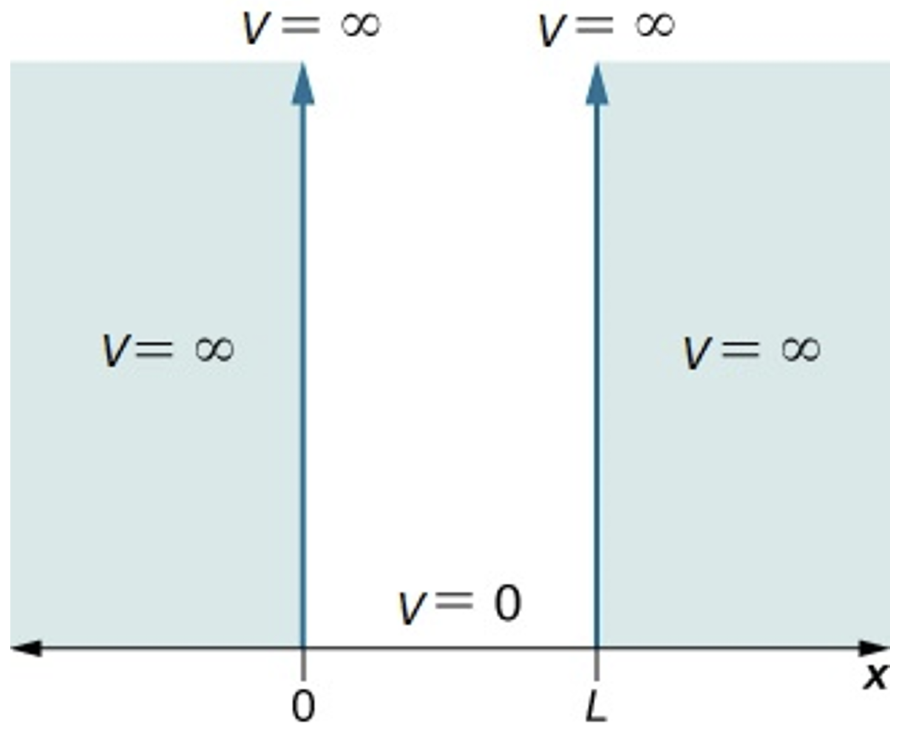
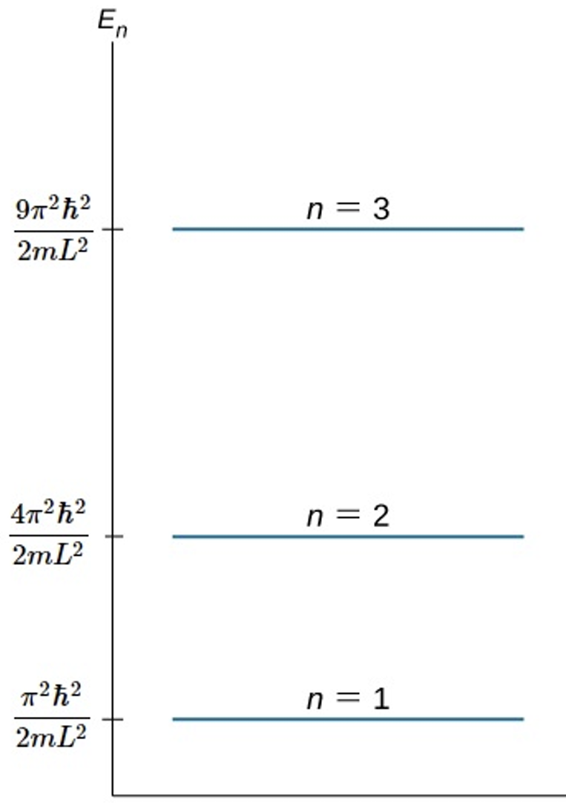

# O Modelo da Partícula em uma Caixa Unidimensional

A complexidade de resolver a Equação de Schödinger depende da complexidade da função de energia potencial do sistema: $V(x)$. O modelo da "Partícula em uma Caixa" é um dos problemas mais simples e importantes da mecânica quântica. Essa simplicidade surge do fato de $V(x)$ ser constante e, além disso, igual a zero, para as regiões permitidas à partícula. Ele descreve uma partícula confinada em uma região finita do espaço, servindo como uma excelente introdução aos conceitos de quantização de energia e funções de onda.

Apesar de sua simplicidade, este modelo pode ser usado para aproximar o comportamento de sistemas reais, como os elétrons em moléculas conjugadas ou em nanocristais (pontos quânticos).

## 1. Definição do Problema

Imagine uma partícula de massa $m$ que pode se mover livremente, mas apenas ao longo de uma dimensão (o eixo $x$). Essa partícula está confinada dentro de uma "caixa" de comprimento $L$.

Para representar esse confinamento, usamos o conceito de energia potencial ($V(x)$).

Dentro da caixa ($0 < x < L$), a partícula não sofre a ação de nenhuma força, então sua energia potencial é constante. Por simplicidade, definimos $V(x) = 0$.

Fora da caixa ($x \le 0$ ou $x \ge L$), uma força infinitamente grande impede que a partícula escape. Isso é representado por uma energia potencial infinita, $V(x) = \infty$.

Matematicamente:

$$V(x) = \begin{cases} 
0, & \text{se } 0 < x < L \\
\infty, & \text{se } x \le 0 \text{ ou } x \ge L
\end{cases}$$

<figure style="text-align: center;">
  
  <figcaption>Figura 1: Gráfico do potencial V(x) para o modelo da partícula em uma caixa. Fonte: Delmar Larsen <em>et al</em>. Licenciado sob <a href="https://creativecommons.org/licenses/by-nc-sa/4.0/">CC BY-NC-SA 4.0</a>.</figcaption>
</figure>

Como a energia potencial é infinita fora da caixa, a probabilidade de encontrar a partícula nessas regiões é zero. Isso significa que a função de onda $\psi(x)$ deve ser zero fora da caixa.

## 2. A Equação de Schrödinger

Para encontrar os estados de energia permitidos e as funções de onda correspondentes, resolvemos a Equação de Schrödinger Independente do Tempo:

$$\hat{H}\psi(x) = E\psi(x)$$

Onde:

$\psi(x)$ é a função de onda, que descreve um possível estado da partícula.

$E$ é a energia total da partícula naquele estado específico (um valor numérico).

$\hat{H}$ é o operador Hamiltoniano, que representa a energia total do sistema. É aqui que iremos usar a função de energia potencial.

O Hamiltoniano é a soma dos operadores de energia cinética e potencial:

$$\hat{H} = -\frac{\hbar^2}{2m}\frac{\mathrm{d}^2}{\mathrm{d}x^2} + V(x)$$

$\hbar$ é a constante de Planck reduzida.

$$\hbar = \frac{h}{2\pi}$$

$m$ é a massa da partícula.

Como estamos interessados no que acontece dentro da caixa, usamos $V(x) = 0$. A equação de Schrödinger se reduz a:

$$-\frac{\hbar^2}{2m}\frac{\mathrm{d}^2\psi(x)}{\mathrm{d}x^2} = E\psi(x)$$

Rearranjando a equação, obtemos uma equação diferencial de segunda ordem:

$$\frac{\mathrm{d}^2\psi(x)}{\mathrm{d}x^2} = -\frac{2mE}{\hbar^2}\psi(x)$$

## 3. Resolvendo a Equação e Aplicando as Condições de Contorno

Para simplificar, vamos definir uma constante $k^2$:

$$k^2 = \frac{2mE}{\hbar^2}$$

A equação se torna:

$$\frac{\mathrm{d}^2\psi}{\mathrm{d}x^2} = -k^2\psi$$

Podemos nos perguntar: quais funções matemáticas, quando derivadas duas vezes, resultam nelas mesmas multiplicadas por uma constante negativa?

As candidatas naturais são as funções trigonométricas seno e cosseno. Vamos testá-las por substituição direta:

Tentativa com $\psi(x) = \sin(kx)$:

$$\frac{\mathrm{d}\psi}{\mathrm{d}x} = k\cos(kx) \implies \frac{\mathrm{d}^2\psi}{\mathrm{d}x^2} = -k^2\sin(kx) = -k^2\psi(x)$$

Esta função satisfaz a equação.

Tentativa com $\psi(x) = \cos(kx)$:

$$\frac{\mathrm{d}\psi}{\mathrm{d}x} = -k\sin(kx) \implies \frac{\mathrm{d}^2\psi}{\mathrm{d}x^2} = -k^2\cos(kx) = -k^2\psi(x)$$

Esta função também satisfaz a equação.

Como a equação diferencial é linear, a soma dessas soluções (superposição) também é uma solução válida. Portanto, a solução geral é uma combinação linear de ambas:

$$\psi(x) = A\sin(kx) + B\cos(kx)$$

Podemos provar que essa combinação funciona substituindo-a diretamente na equação original. Derivando a solução geral duas vezes:

$$\frac{\mathrm{d}\psi}{\mathrm{d}x} = \frac{\mathrm{d}}{\mathrm{d}x}[A\sin(kx) + B\cos(kx)] = Ak\cos(kx) - Bk\sin(kx)$$

$$\frac{\mathrm{d}^2\psi}{\mathrm{d}x^2} = \frac{\mathrm{d}}{\mathrm{d}x}[Ak\cos(kx) - Bk\sin(kx)] = -Ak^2\sin(kx) - Bk^2\cos(kx)$$

Fatorando $-k^2$:

$$\frac{\mathrm{d}^2\psi}{\mathrm{d}x^2} = -k^2 [A\sin(kx) + B\cos(kx)] = -k^2\psi(x)$$

Isso confirma que a combinação linear satisfaz a equação diferencial.

Agora, usamos as condições de contorno para encontrar as constantes $A$ e $B$. Sabemos que a função de onda deve ser contínua, e como ela é zero fora da caixa, ela precisa ser nula nos limites da mesma, caso contrário a continuidade é perdida.

$\psi(0) = 0$: A função de onda deve ser zero na parede (em $x=0$).

$$\psi(0) = A\sin(k \cdot 0) + B\cos(k \cdot 0) = 0$$

$$A \cdot 0 + B \cdot 1 = 0 \implies B = 0$$

Portanto, a função de onda deve ser da forma:

$$\psi(x) = A\sin(kx)$$

$\psi(L) = 0$: A função de onda também deve ser zero na parede, em $x=L$.

$$\psi(L) = A\sin(kL) = 0$$

Se $A=0$, então $\psi(x)$ seria nulo em qualquer lugar e não haveria partícula. Assim, só resta a possibilidade de $\sin(kL) = 0$.

A função seno é zero para múltiplos inteiros de $\pi$ e é aqui que surge a quantização. Para satisfazer às condições de contorno, é necessário que o argumento seja restrito a múltiplos de $\pi$.

$$kL = n\pi$$

Onde $n$ é um número inteiro.

$n$ não pode ser 0, pois isso também levaria a $\psi(x)=0$.

$n$ só pode ser um natural não nulo ($1, 2, 3, \dots$). Valores negativos de $n$ não geram novas soluções físicas, apenas invertem o sinal da função de onda.

Pelo fato de $n$ restringir as funções de onda da partícula (e outras propriedades), dizemos que ele é um número quântico..

## 4. Quantização da Energia

A partir da condição $kL = n\pi$, acabamos de descobrir que a constante $k$ (definida anteriormente) é, também, quantizada, no sentido que, para cada estado $\psi_n(x)$, existe um único valor de $k$ (poderíamos representar por $k_n$, mas vamos economizar notação). Dessa forma:

$$k = \frac{n\pi}{L}$$

Como $k$ está ligado à energia do sistema (por definição), agora, substituímos $k$ de volta na equação $k^2 = 2mE/\hbar^2$:

$$\left(\frac{n\pi}{L}\right)^2 = \frac{2mE_n}{\hbar^2}$$

E obtemos os níveis de energia quantizados:

$$\boxed{E_n = \frac{n^2\pi^2\hbar^2}{2mL^2}} \quad \text{com } n=1, 2, 3, \dots$$

Lembrando que $\hbar = h/2\pi$, podemos reescrever como:

$$\boxed{E_n = \frac{n^2h^2}{8mL^2}}$$

### Principais conclusões sobre a energia

A energia da partícula é quantizada: ela só pode assumir valores discretos que dependem do número quântico $n$.
Vamos listar os primeiros níveis em termos da energia do estado fundamental ($E_1$) para facilitar a visualização:

$n=1 \implies E_1 = 1 E_1$

$n=2 \implies E_2 = 4 E_1$

$n=3 \implies E_3 = 9 E_1$

$n=4 \implies E_4 = 16 E_1$

$n=5 \implies E_5 = 25 E_1$

A energia aumenta com o quadrado de $n$ ($E \propto n^2$).

A energia é inversamente proporcional ao quadrado do tamanho da caixa ($E \propto 1/L^2$). Caixas menores resultam em maiores espaçamentos de energia.

<figure style="text-align: center;">
  
  <figcaption>Níveis de energia permitidos para a partícula em uma caixa. A energia é quantizada e o espaçamento entre os níveis aumenta com o número quântico n. Fonte: Delmar Larsen <em>et al</em>. Licenciado sob <a href="https://creativecommons.org/licenses/by-nc-sa/4.0/">CC BY-NC-SA 4.0</a>.</figcaption>
</figure>

### Energia de ponto zero
O nível de energia mais baixo permitido é para $n=1$:

$$E_1 = \frac{h^2}{8mL^2}$$

Isso significa que a partícula nunca pode ter energia zero. Ao contrário da mecânica clássica, onde uma partícula pode estar em repouso absoluto ($E=0$), na mecânica quântica ela possui uma energia cinética residual mínima.

### Por que isso acontece?
Isso é uma consequência direta do Princípio da Incerteza de Heisenberg ($\Delta x \cdot \Delta p \geq \hbar/2$):

Como a partícula está confinada na caixa, a incerteza em sua posição é finita ($\Delta x \approx L$).

Para satisfazer o princípio, a incerteza no momento linear ($\Delta p$) não pode ser zero.

Se $\Delta p \neq 0$, o momento linear $p$ não pode ser perfeitamente nulo (repouso), pois implicaria que o momento seria totalmente conhecido. Logo, a partícula deve estar sempre em movimento, o que resulta necessariamente em uma energia cinética positiva ($E_1 > 0$).

## 5. Normalização da Função de Onda

A função de onda atualizada é $\psi_n(x) = A\sin(n\pi x/L)$ e ainda não temos a constante $A$. Para encontrá-la, usamos o fato de que a probabilidade total de encontrar a partícula dentro da caixa deve ser 1.

A densidade de probabilidade é dada por $|\psi(x)|^2 = \psi(x)^*\psi(x)$ e, aplicando a condição de normalização (repare que os limites de integração originais da condição de normalização deveriam ser $-\infty$ e $+\infty$, mas, como a função de onda é nula fora da caixa, restringimos a $0 \le x \le L$):

$$\int_0^L \psi_n^*(x)\psi_n(x)\mathrm{d}x = \int_0^L \left|A\sin\left(\frac{n\pi x}{L}\right)\right|^2 \mathrm{d}x = 1$$

$$A^2 \int_0^L \sin^2\left(\frac{n\pi x}{L}\right) \mathrm{d}x = 1$$

De uma tabela de integrais:

$$\int\sin^2(ax)\mathrm{d}x = \frac{x}{2} - \frac{\sin(2ax)}{4a}$$

Resolvendo a integral definida de $0$ a $L$:

$$\int_0^L \sin^2\left(\frac{n\pi x}{L}\right) \mathrm{d}x = \left[ \frac{x}{2} - \frac{\sin(2n\pi x/L)}{4n\pi/L} \right]_0^L = \frac{L}{2} - 0 = \frac{L}{2}$$

Substituindo de volta:

$$A^2 \left(\frac{L}{2}\right) = 1 \implies A = \sqrt{\frac{2}{L}}$$

Finalmente, as funções de onda normalizadas são (no plural porque $n$ cria infinitas funções de onda):

$$\psi_n(x) = \sqrt{\frac{2}{L}}\sin\left(\frac{n\pi x}{L}\right) \quad \text{para } 0 < x < L$$

### Análise das Funções de Onda

Nós: São pontos onde $\psi(x) = 0$ (e a probabilidade de encontrar a partícula é zero). O número de nós para um dado $n$ é $n-1$.

Densidade de Probabilidade ($|\psi_n(x)|^2$): Mostra as regiões onde a partícula é mais provável de ser encontrada. Diferente da visão clássica (onde a probabilidade seria uniforme), a partícula tem maior probabilidade de ser encontrada em certas posições (os picos).

### Visualizando as Densidades de Probabilidade

A densidade de probabilidade, $|\psi_n(x)|^2$, nos dá a probabilidade de encontrar a partícula em uma determinada posição $x$. Vamos analisar os primeiros estados:

*   **Para n=1 (Estado Fundamental)**:
    $|\psi_1(x)|^2 = \frac{2}{L}\sin^2\left(\frac{\pi x}{L}\right)$
    A probabilidade é máxima no centro da caixa ($x=L/2$) e nula nas paredes. Isso contradiz a intuição clássica, que previa uma probabilidade igual em todos os pontos.

*   **Para n=2 (Primeiro Estado Excitado)**:
    $|\psi_2(x)|^2 = \frac{2}{L}\sin^2\left(\frac{2\pi x}{L}\right)$
    Existem dois picos de probabilidade máxima em $x=L/4$ e $x=3L/4$. Curiosamente, há um nó no centro da caixa ($x=L/2$), o que significa que a partícula tem probabilidade zero de ser encontrada no meio do caminho.

*   **Para n=3**:
    $|\psi_3(x)|^2 = \frac{2}{L}\sin^2\left(\frac{3\pi x}{L}\right)$
    Apresenta três picos de probabilidade e dois nós.

À medida que $n$ aumenta, o número de picos aumenta e a distribuição de probabilidade começa a se assemelhar à distribuição uniforme prevista pela mecânica clássica, um exemplo do princípio da correspondência.

## 6. Exemplo: Elétrons $\pi$ no Butadieno

O modelo da partícula em uma caixa pode ser usado para estimar a energia da primeira transição eletrônica (absorção de luz UV-Vis) na molécula de 1,3-butadieno ($CH_2=CH-CH=CH_2$).

O butadieno tem 4 elétrons $\pi$ deslocalizados ao longo da cadeia de quatro carbonos. Podemos tratar esses elétrons como partículas em uma caixa 1D.

### Comprimento da Caixa (L)
O comprimento da caixa pode ser aproximado pela extensão da cadeia de carbonos.

Comprimento da ligação $C=C \approx 1.35$ Å

Comprimento da ligação $C-C \approx 1.54$ Å

$L \approx (1.54 \text{ Å}) + 2 \times (1.35 \text{ Å}) + (\text{raios dos carbonos nas pontas}) \approx 5 \text{ Å} = 5.0 \times 10^{-10} \text{ m}$.

### Preenchimento dos Níveis de Energia
Pelo Princípio de Exclusão de Pauli, cada nível de energia $n$ pode acomodar 2 elétrons (um com spin "para cima", outro "para baixo").

Os 4 elétrons $\pi$ preencherão os dois primeiros níveis de energia ($n=1$ e $n=2$).

### Transição Eletrônica
A absorção de luz promove um elétron do nível de energia mais alto ocupado (HOMO) para o nível de energia mais baixo desocupado (LUMO).

HOMO: $n=2$

LUMO: $n=3$

### Cálculo da Energia da Transição ($\Delta E$)

$$\Delta E = E_{LUMO} - E_{HOMO} = E_3 - E_2$$

$$\Delta E = \frac{3^2h^2}{8mL^2} - \frac{2^2h^2}{8mL^2} = \frac{(9-4)h^2}{8mL^2} = \frac{5h^2}{8mL^2}$$

$h$ (Constante de Planck) = $6.626 \times 10^{-34} \text{ J}\cdot\text{s}$

$m$ (massa do elétron) = $9.109 \times 10^{-31} \text{ kg}$

$L$ = $5.0 \times 10^{-10} \text{ m}$

Substituindo os valores:

$$\Delta E = \frac{5 \cdot (6.626 \times 10^{-34})^2}{8 \cdot (9.109 \times 10^{-31}) \cdot (5.0 \times 10^{-10})^2} \approx 1.2 \times 10^{-18} \text{ J}$$

### Cálculo do Comprimento de Onda ($\lambda$)
A energia da transição está relacionada ao comprimento de onda da luz absorvida pela equação $\Delta E = hc/\lambda$.

$c$ (velocidade da luz) = $3.0 \times 10^8 \text{ m/s}$

$$\lambda = \frac{hc}{\Delta E} = \frac{(6.626 \times 10^{-34}) \cdot (3.0 \times 10^8)}{1.2 \times 10^{-18}} \approx 1.65 \times 10^{-7} \text{ m} = 165 \text{ nm}$$

O valor experimental para a absorção máxima do butadieno é em torno de 217 nm. Considerando a extrema simplicidade do modelo, nosso resultado de 165 nm é uma aproximação razoável e demonstra o poder preditivo da mecânica quântica.